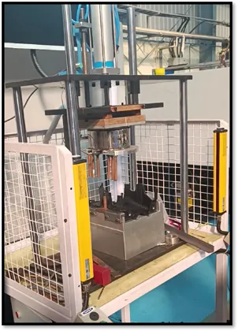

# CONTENT.md — How to add & change website content

Goal: every update = **edit files → push to GitHub → site updates automatically**.
You never need to touch the client's GoDaddy account for content (DNS was one-time).

Working copy of the site lives on the PC in `E:\nsk-automation\`.
The deployable copy is `E:\nsk-automation\repo\`.

**After any change**, do:
```
cd E:\nsk-automation\repo
```
Then re-sync changed files from `E:\nsk-automation\` and:
```
git add .
git commit -m "Describe the change"
git push origin main
```
Live in 1–3 minutes at https://www.nskautomation.co.in.

---

## Rule of thumb
- **Copy an existing HTML block** for what you want to add, paste it next to the
  original, then change the text/images. Copying a working block is faster and safer
  than writing new code.
- Keep every image link as a **relative path** to `assets/images/…`.
- Keep videos as 720p H.264 MP4 (this is how they're stored now).

---

## 1. New machine / product card

Card blocks live inside the **Machines We Build** section of `index.html`.
Example card to copy (PVC Welding):

```html
<article class="machine-card reveal">
  <div class="card-media">
    
    <span class="project-status">Video available</span>
  </div>
  <div class="card-body">
    <span class="machine-tag">Custom Built</span>
    <h3>PVC Welding Machine</h3>
    <p>Short, factual description…</p>
    <button class="btn btn-outline btn-sm" type="button"
            data-video="assets/videos/pvc-welding-01.mp4;assets/videos/pvc-welding-02.mp4;assets/videos/pvc-welding-03.mp4"
            data-variants="Clip 1;Clip 2;Clip 3">Watch Video</button>
  </div>
</article>
```

Steps:
1. Put the photo in `assets/images/` (WebP, ≤800px wide — see Optimizing below).
2. If a video exists, put 720p MP4 in `assets/videos/`.
3. Copy a machine card, change text + file names.
4. Read section heading count check: machines grid auto-sizes; 3-per-row on desktop.

No video? Omit the button and change the badge to
`<span class="project-status badge-soon">Video coming soon</span>`.

---

## 2. New project / case study card

Copy a card from the **Our Projects & Customers** section (e.g. Tata Electronics).

```html
<article class="project-card reveal">
  <div class="project-media">
    <video class="card-video" controls preload="metadata" playsinline
           src="assets/videos/tata-electronics-project.mp4"></video>
    <span class="project-status">Completed</span>
  </div>
  <div class="card-body">
    <h3>Your Customer Name</h3>
    <p class="project-customer"><strong>Customer:</strong> Company, Location</p>
    <p>What was delivered…</p>
    <p class="project-year">Delivered 2024</p>
  </div>
</article>
```

- `preload="metadata"` keeps the page fast — only the first frame is downloaded.

---

## 3. Add a video to an existing card

1. Convert to 720p H.264 MP4:
   ```
   ffmpeg -i input.mp4 -vf scale=-2:720 -c:v libx264 -preset medium -crf 25 -maxrate 1700k -bufsize 3000k -c:a aac -b:a 96k -movflags +faststart assets/videos/name.mp4
   ```
2. Point a `data-video="assets/videos/name.mp4"` on the card's Watch Video button.
3. Multi-clip: separate clips with `;` in `data-video`, give labels in `data-variants`
   (see the PVC card).

---

## 4. Gallery / photo updates

Gallery blocks are the four Mahindra images under **Training Cell** and **Our Projects**.
Swap the `src` file name — keep the same size/ratio for a tidy grid. Use
`loading="lazy" decoding="async"` on every image below the fold.

---

## 5. Text / contact details updates

All visible text is in `index.html` — search for the words, edit, save.
Ones to keep in sync: phone numbers, email, address, GSTIN (footer + contact section).

## 6. Emails & the enquiry form

The form posts to **Formspree** (endpoint in `js/main.js` →
`FORM_ENDPOINT = "https://formspree.io/f/…"`). To change who receives enquiries, edit the
Formspree dashboard's notification email (not the code). The Gmail CC is a fallback listed
in `form-note`.

---

## Optimizing images (before adding)

Keep files small so the site stays fast:
```
ffmpeg -i input.jpg -vf scale="min(1600,iw)":-2 -q:v 4 output.jpg       # photo
ffmpeg -i input.png -vf scale="min(420,iw)":-2 -c:v libwebp -quality 80 -compression_level 6 output.webp   # transparent art
```
WebP (transparency) for logo/machine art; JPEG for photos. ≤100KB each is the target.

---

## Where things are
| What | Where |
|---|---|
| Page | `index.html` |
| Styles | `css/style.css` |
| Behaviour (nav, reveal, video modal, form) | `js/main.js` |
| Images | `assets/images/` |
| Videos (720p) | `assets/videos/` |
| Full-res originals | `E:\nsk-automation\backup\` (never commit these) |